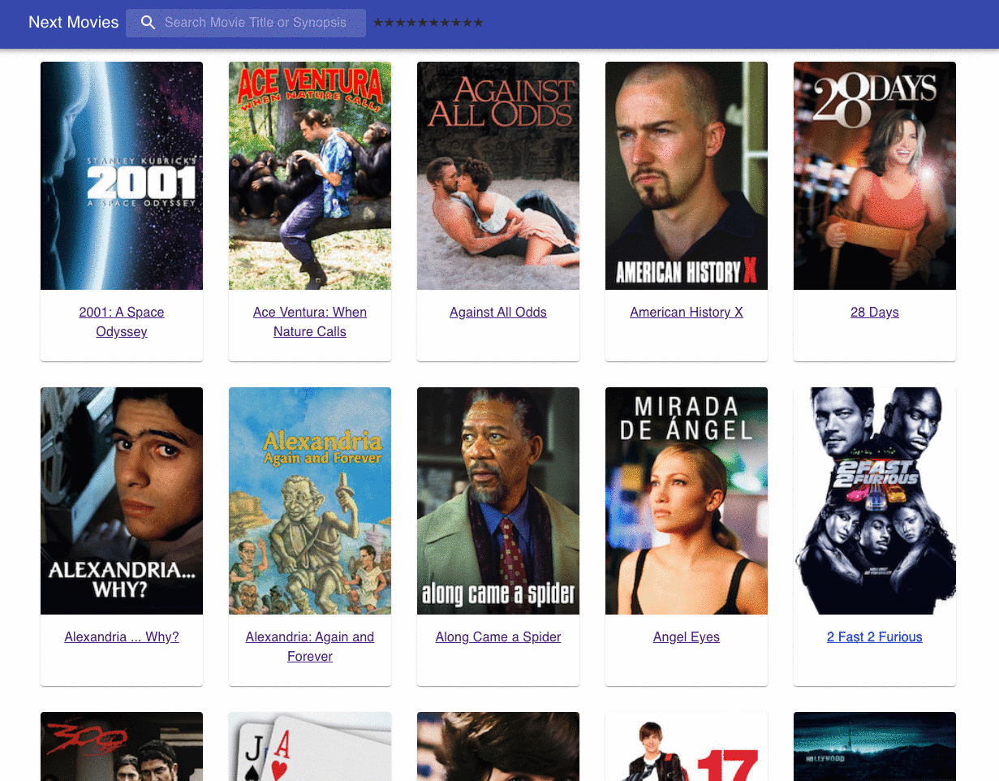

# Next Movies React App

.

## Available Scripts

## Run the server

1. Download the repository https://github.com/next-insurance/next-test
2. Install npm modules: `npm install`
3. Start up the server: `npm start`

## Run the client

1. In the project directory, you can run:
2. Install npm modules: `npm install`
3. Start up the server: `npm start`
4. Open [http://localhost:3001](http://localhost:3001) to view it in the browser.

The page will reload if you make edits.\
You will also see any lint errors in the console.
